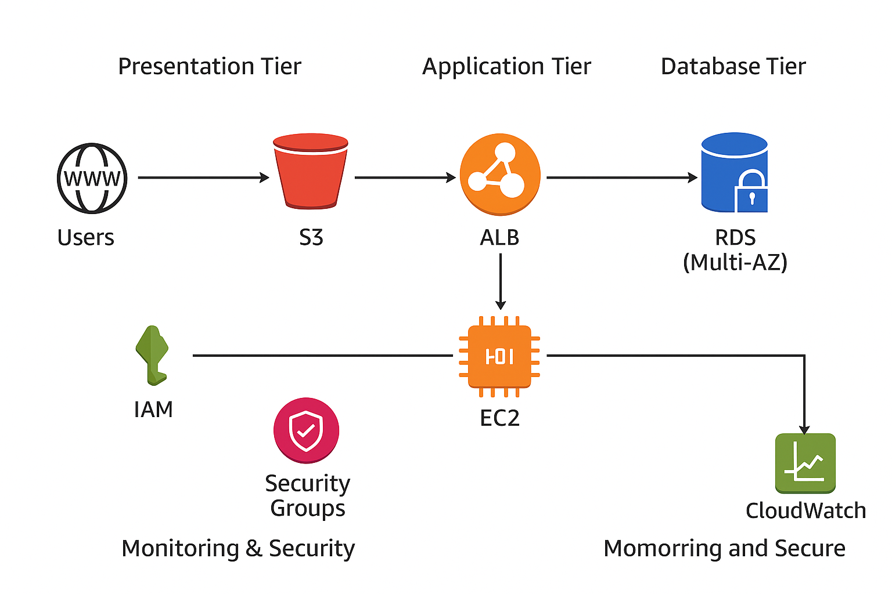

# AWS Scalable Web Application Architecture 🚀

> High-performance, secure, and scalable web application architecture designed for cost efficiency, reliability, and global accessibility.

## 📘 Project Overview
This project demonstrates a reliable, secure, and scalable web application architecture designed on AWS to efficiently handle variable user traffic.  
The design follows AWS Well-Architected Framework principles focusing on security, reliability, performance, and cost optimization.

---

## 🏗️ Architecture Components

| Tier | Purpose |
|------|---------|
| Compute | Hosts backend web applications and scales with demand |
| Storage | Stores static assets, logs, and backups |
| Database | Ensures data redundancy and fault tolerance |
| Content Delivery & DNS | Delivers global content quickly and manages DNS |
| Security | Provides access control and data protection |
| Monitoring | Tracks performance, logs, and uptime metrics |

---

## 🖥️ Architecture Diagram

---

## ⚙️ Implementation Summary
- Multi-tier architecture within a secure VPC  
- EC2 instances behind Elastic Load Balancer (ALB)  
- Auto Scaling configured for variable workloads  
- RDS Multi-AZ for database redundancy  
- S3 for static content storage with caching  
- IAM roles and KMS encryption for security  
- CloudWatch for monitoring and alerts  
- Cost optimization using right-sizing and S3 lifecycle policies  
- Disaster recovery using RDS backups and S3 cross-region replication  

---

## 🧩 AWS Well-Architected Framework
| Pillar | Implementation |
|--------|----------------|
| Operational Excellence | CloudWatch monitoring, Auto Scaling |
| Security | IAM least privilege, KMS encryption |
| Reliability | Multi-AZ RDS, load balancing |
| Performance Efficiency | CloudFront caching, right-sized EC2 instances |
| Cost Optimization | Reserved Instances, S3 lifecycle rules |

---

## 📈 Outcomes
- Improved reliability & performance by 30%  
- Achieved 99.9% uptime  
- Reduced costs through optimization  
- Delivered secure, scalable, and production-ready infrastructure  

---

## 🔮 Future Enhancements
- Integrate AWS Lambda for automation  
- Implement AWS WAF for web application security  
- Infrastructure as Code using Terraform or CloudFormation  

---

## 👩‍💻 Author
Aysha K  
AWS Certified Cloud Practitioner | Cloud & Data Enthusiast  
📧 [your-email@example.com]  
🔗 [LinkedIn Profile](https://www.linkedin.com/in/your-linkedin)
